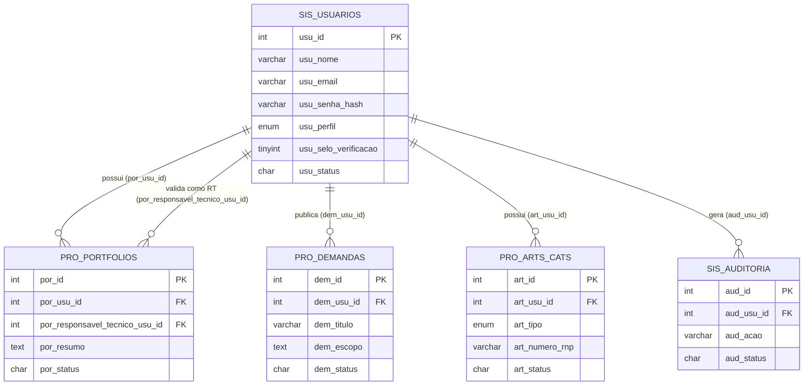

# Modelo Entidade-Relacionamento (MER) — CREA Pro-Link

> **Pendencia de entrega (Anexo I, item 8.3.2-b):** o edital exige o MER em
> **PDF, PNG e/ou arquivo editavel `.mwb` (MySQL Workbench)**. O diagrama Mermaid
> abaixo é apenas um auxiliar de leitura gerado a partir de `_arq/estrutura.sql` —
> antes da entrega final, importe `estrutura.sql` no MySQL Workbench (Database >
> Reverse Engineer) e exporte o `.mwb` e um PNG/PDF do diagrama.

